# Построение защищённого API для работы с большой языковой моделью.
Выполнил: Хилалов Муслим\
Группа: М25-555

## Описание возможностей

- регистрация пользователей;
- аутентификация пользователей с использованием access JWT-токена;
- получение профиля текущего пользователя;
- написание сообщений к LLM (с контекстом в виде истории и системных инструкций);
- отображение истории сообщений;
- удаление истории сообщений.

## Инструкция к сборке и запуску приложения

1. Клонируйте репозиторий командой `git clone https://github.com/javachka11/llm-p`;
2. Перейдите в директорию проекта командой `cd llm-p`;
3. Скопируйте `.env.example` в `.env` командой `cp .env.example .env`;
4. Отредактируйте файл `.env` (добавьте API-ключ OpenRouter, по желанию поменяйте другие поля);
5. Установите библиотеку `uv` в случае её отсутствия командой `pip install uv`;
6. Синхронизируйтесь с виртуальным окружением проекта командой `uv sync`;
7. Запустите приложение командой `uv run uvicorn app.main:app --reload --host 0.0.0.0 --port 8000`;
8. Готово! Можете проверить статус приложения, перейдя по ссылке [http://0.0.0.0:8000/health](http://0.0.0.0:8000/health).

## API Документация

Swagger UI: [http://0.0.0.0:8000/docs](http://0.0.0.0:8000/docs)

## API Эндпоинты

|Эндпоинт|Описание|
|:-|:-|
|`GET /health`|получить статус приложения|
|`POST /auth/register`|зарегистрировать нового пользователя|
|`POST /auth/login`|залогиниться (с получением JWT-токена)
|`GET /auth/me`|получить профиль текущего пользователя|
|`POST /chat`|отправить сообщение в LLM|
|`GET /chat/history`|получить историю чата|
|`DELETE /chat/history`|удалить историю чата|

## Скриншоты работы эндпоинтов

### Swagger UI
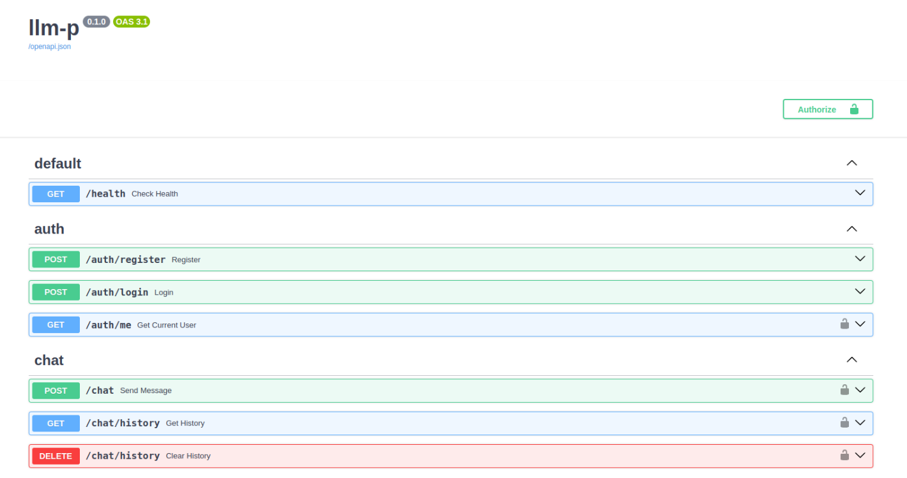

### Health-check
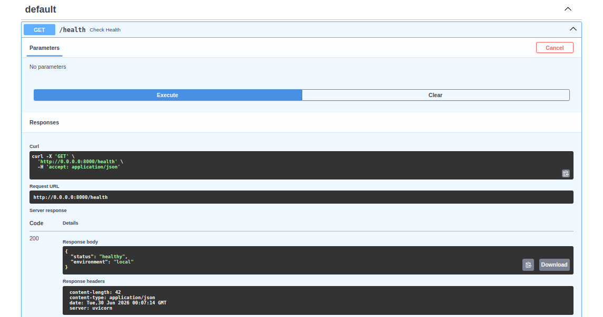

### Регистрация пользователя
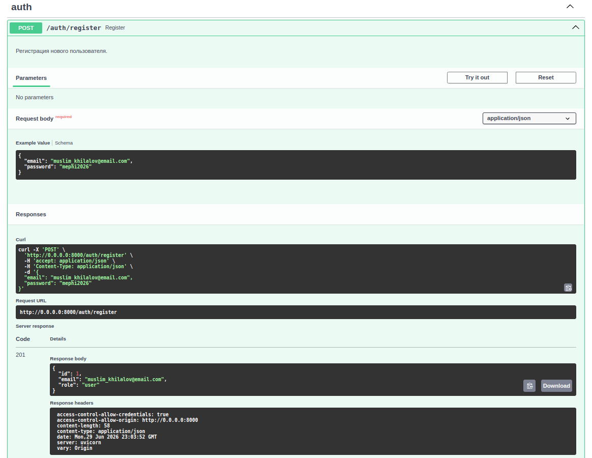

### Регистрация пользователя (email уже существует)
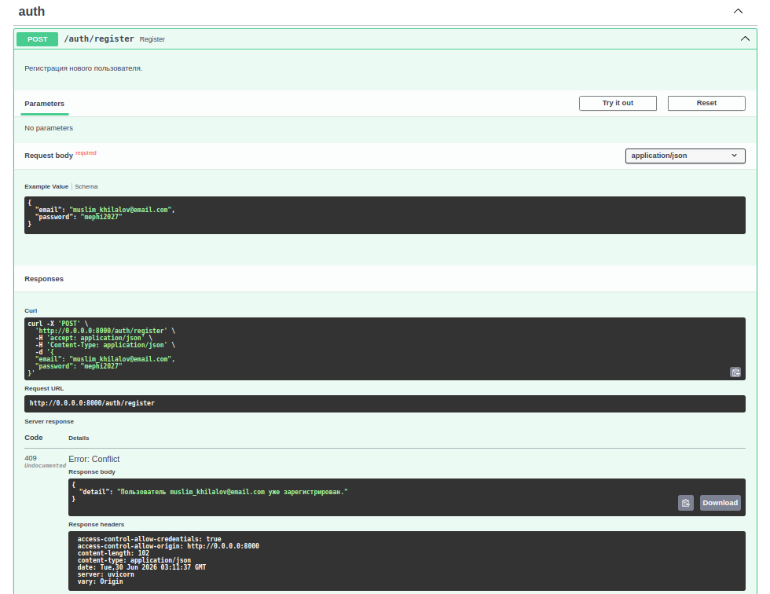

### Логин и получение JWT
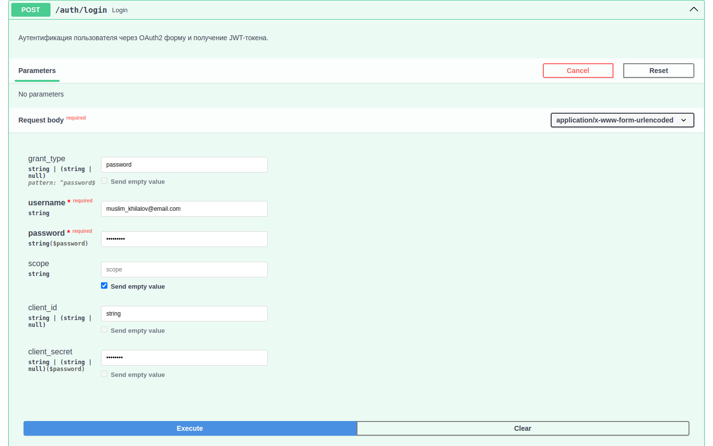
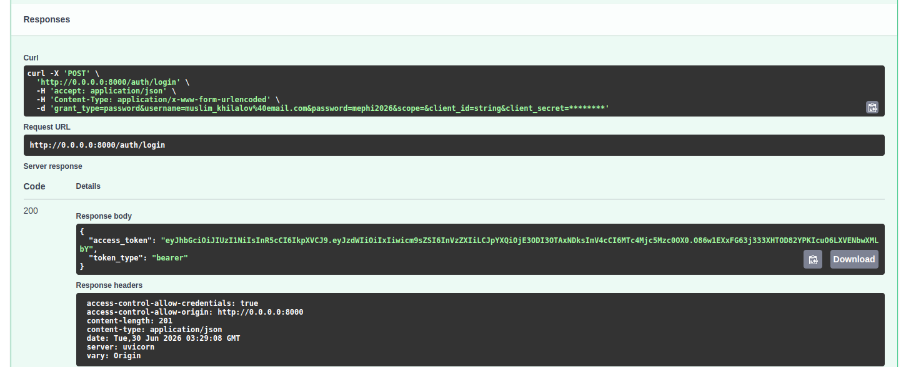

### Логин и получение JWT (пользователя не существует)
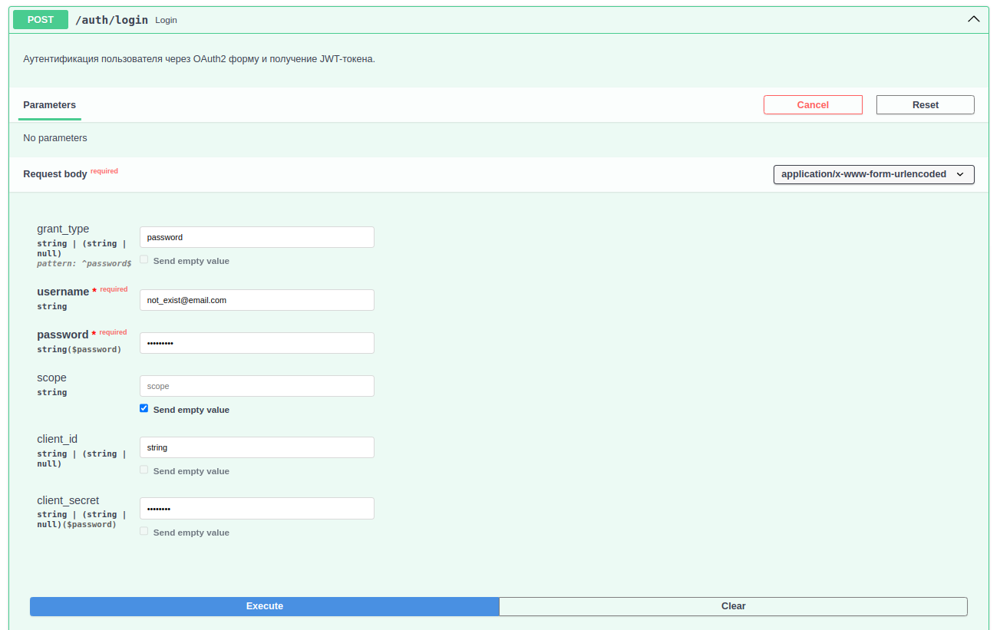
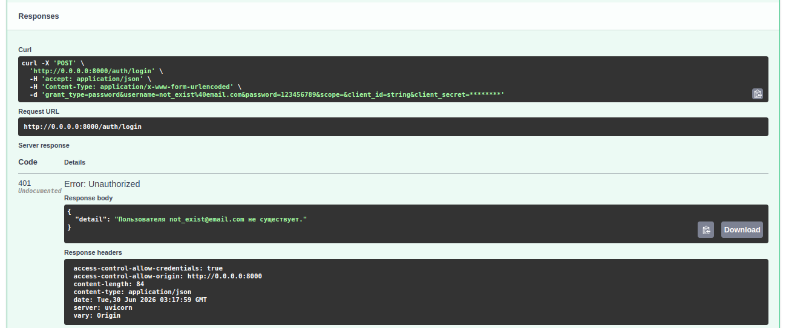

### Логин и получение JWT (неверный пароль)

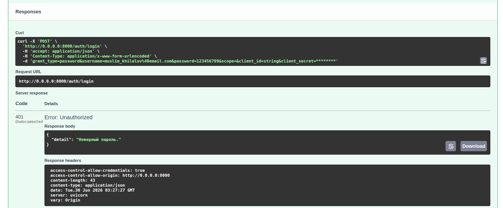

### Авторизация через Swagger
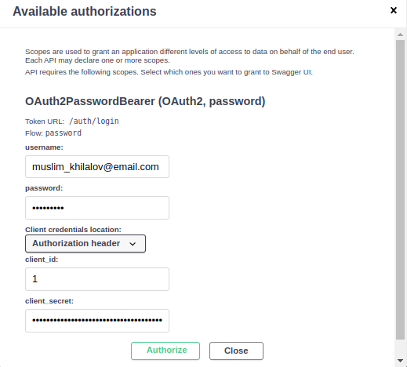
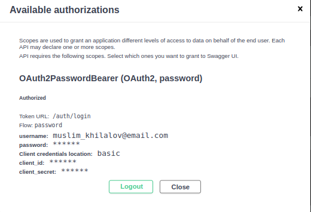

### Вызов POST /chat
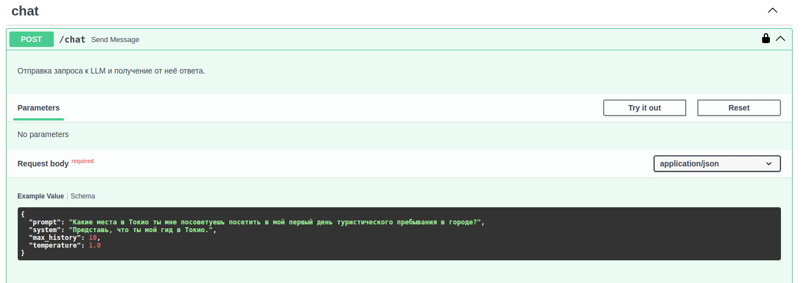
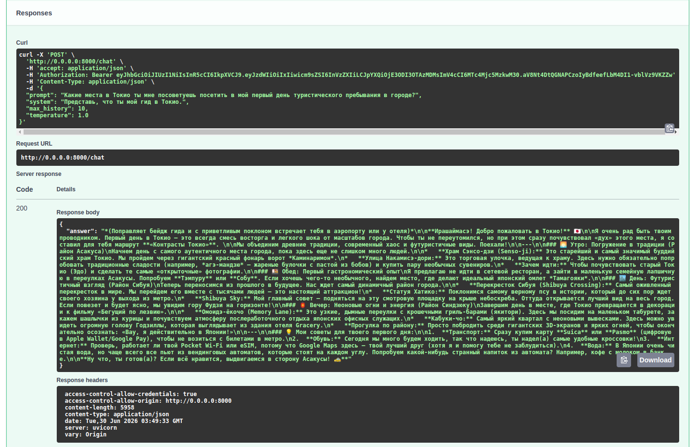

### Получение истории через GET /chat/history
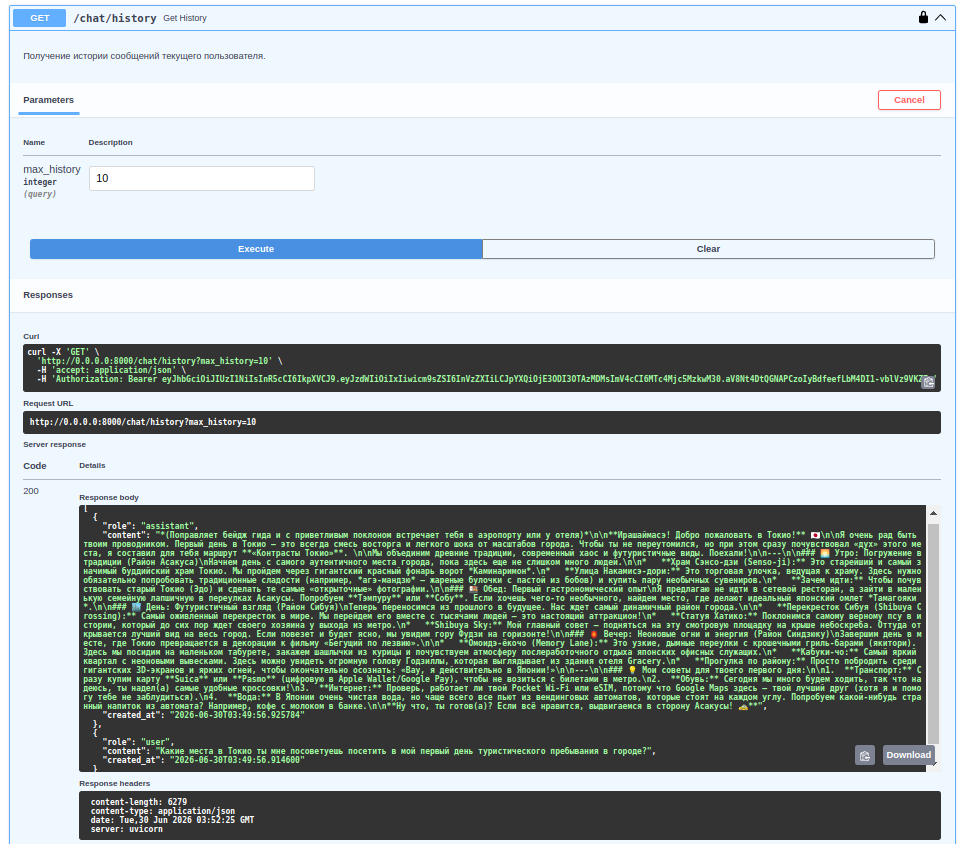

### Удаление истории через DELETE /chat/history
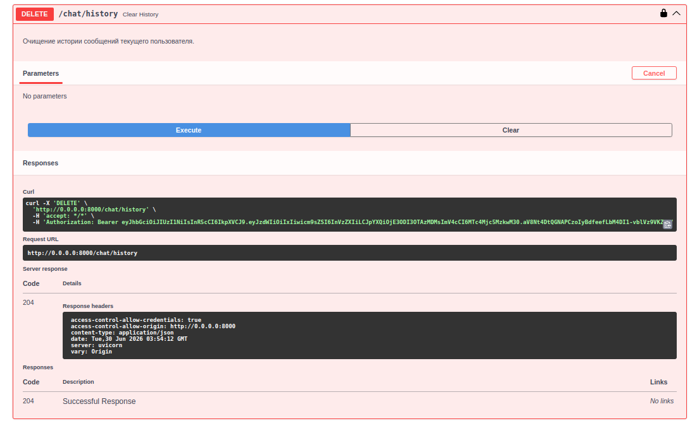
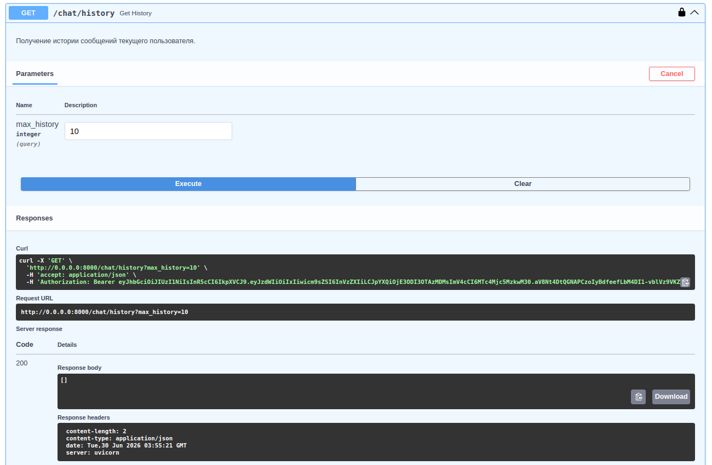

### Получение профиля текущего пользователя (JWT действителен)
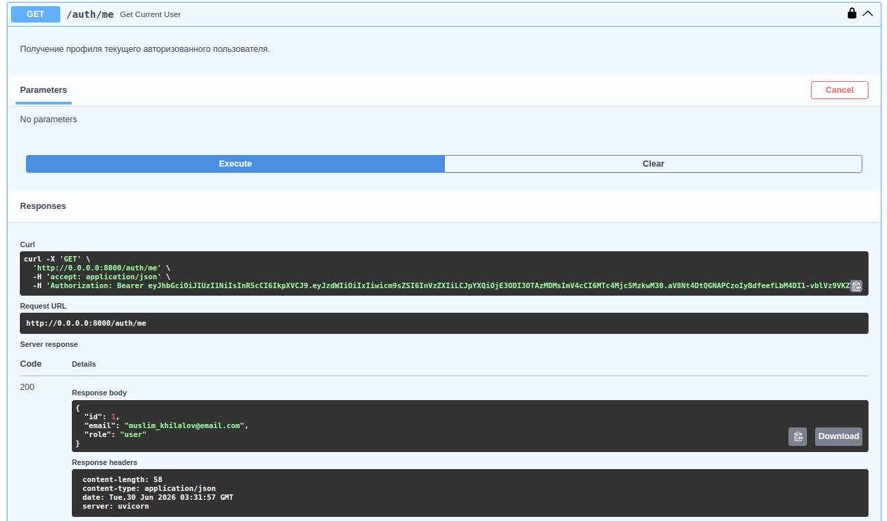

### Получение профиля текущего пользователя (JWT истёк)
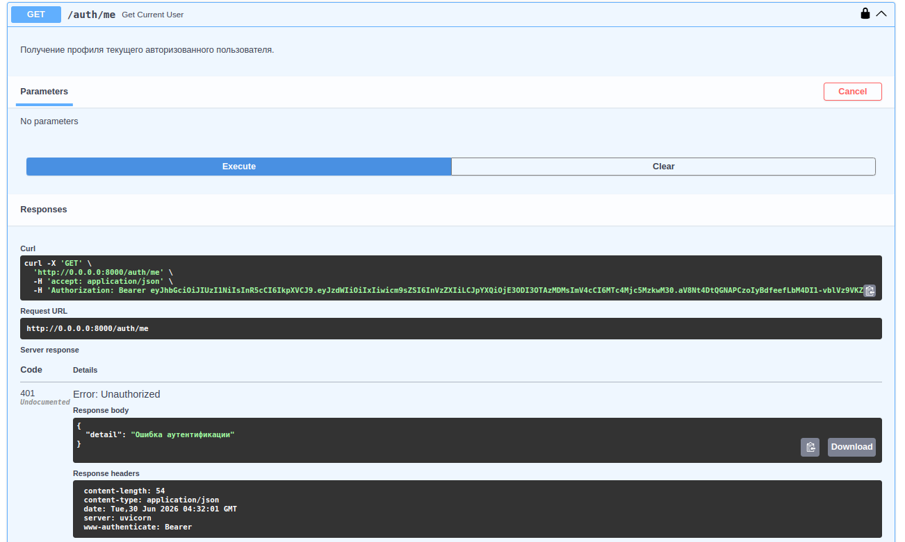